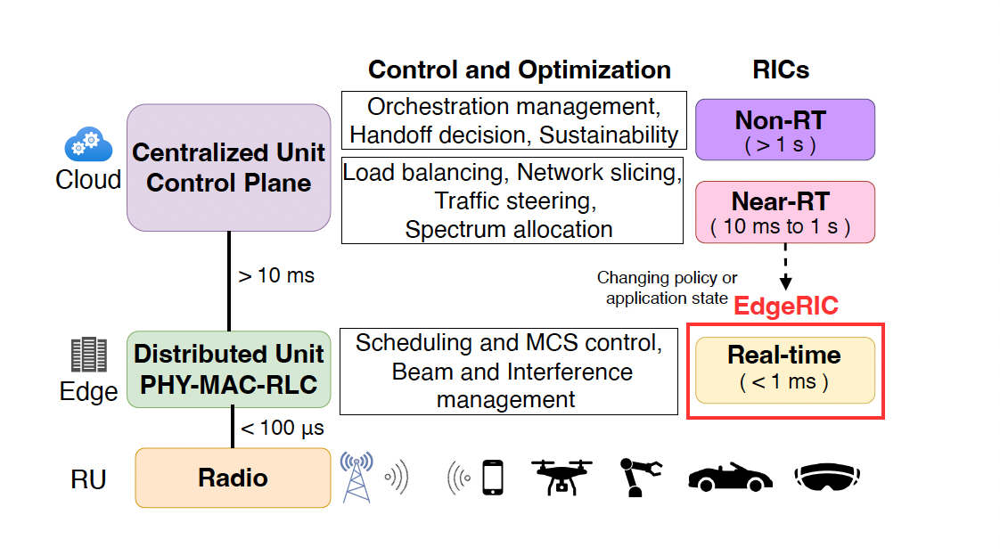
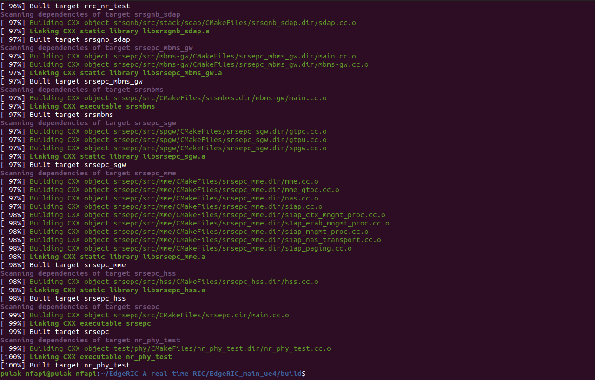
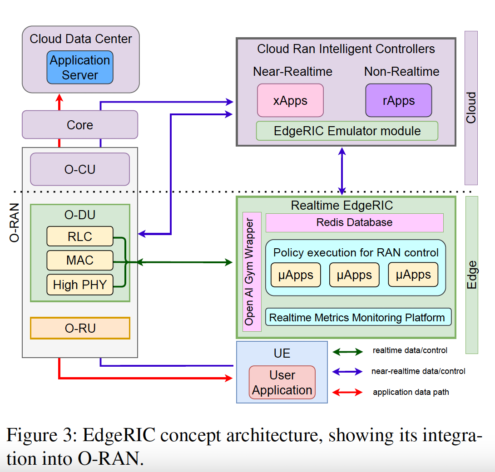
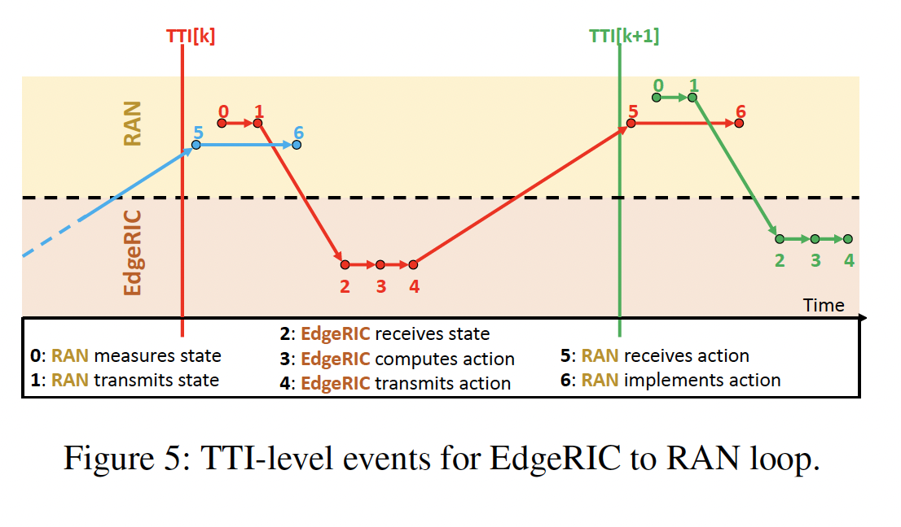
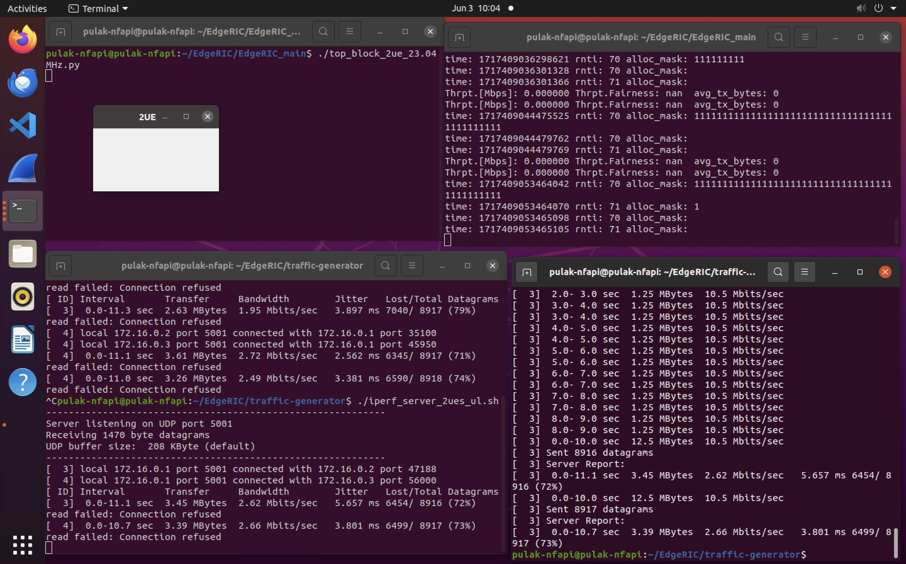
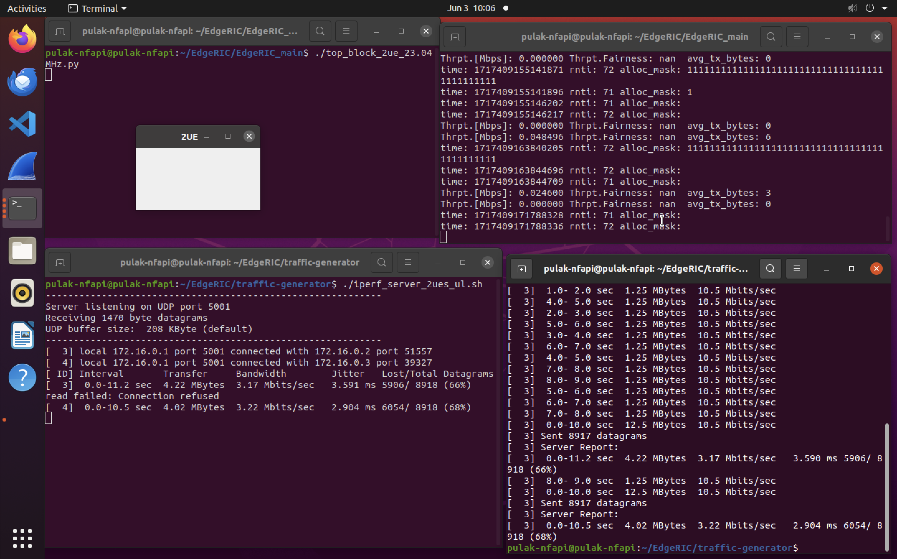
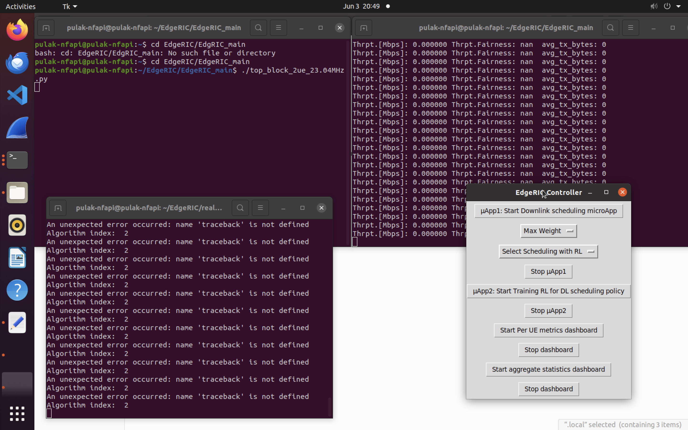
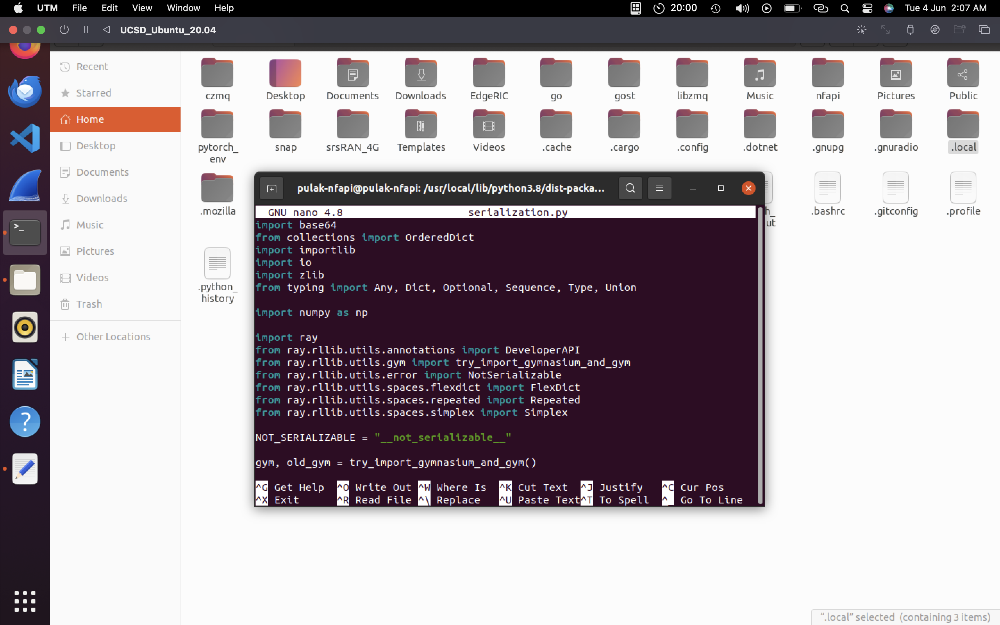

# EdgeRIC 4G Project Tracker - Pulak Mehrotra

A tracker used to both track my understanding of the softwares I am implementing, as well as the results/progress of my implementations. I have also annotated the files I have run to gain a better understanding of the implementation.

## Overall Structure

- A Radio Access Network (RAN) serves as a pivotal element in a wireless telecommunications system, establishing a connection between user devices and the core network via a radio link. Key components of RAN include base stations and antennas. In this project, we emulate the entire stack—from the UE to the O-CU and O-DU utilizing srsRAN.
- O-RAN can be used to break up the usually monolithic implementation into smaller, more application specific modules. Leveraging this, RAN Intelligent Control (RIC) is used to control these interfaces at various time scales. RICs can access data from both the application layer (the layer where end-user applications operate) and the RAN level (where radio communications are managed).
- The need for cellular networks to adapt to different applications, all while keeping up with the fast-paced fluctuations in wireless channels (that require TTI-scale responsive decisions for optimal performance) led to the formulation of EdgeRIC: a real-time RIC module, which facilitates real-time RAN telemetry and control.
- How EdgeRIC Achieves TTI-Level Synchronization
    - *Placement at the Edge*: EdgeRIC is positioned at the edge of the network. This proximity minimizes the delay in transmitting control information to and from the network elements.
    - *Decoupling from the RAN Stack*: EdgeRIC uses O-RAN compliant interfaces to communicate with the RAN stack, ensuring compatibility and seamless integration with various vendors’ equipment. While it operates in sync with the RAN stack, EdgeRIC is decoupled from it, allowing for independent and resilient operation without risking critical RAN functions. This decoupling ensures that EdgeRIC can process data and make decisions without impacting the core operations of the RAN.

<center>

|  |  |
|:-------------------------------------------------:|:---------------------------------------------------------------:|
|                  High-Level EdgeRIC Architecture                 |     Successful EdgeRIC Build                  |

</center>

- It adopts a dual strategy, utilizing real-time edge data alongside cloud analytics to optimize decision-making.
- ZMQ is chosen as the tool for IPC between the Radio Access Network (RAN) and EdgeRIC. This means that ZMQ is used to facilitate communication and data exchange between different processes within the RAN and EdgeRIC systems.
- EdgeRIC ensures various events such as data scheduling, resource allocation, and signal processing are completed within the timeframe of a TTI. TTIs are used to schedule data packets for transmission to and from user equipment (UE) and the base station (e.g., eNodeB in LTE networks). The network scheduler allocates resources for each TTI, determining which user gets to transmit or receive data during that interval.
- Due to the low latency/response time of the setup, EdgeRIC can support AI-in-the-loop policies that are designed to operate at the TTI timescale. These policies can quickly adapt to changing network conditions and optimize performance in real-time.
- The components of the O-RAN stack are as follows:
    - *RF Frontend*: Open Radio Unit (O-RU).
    - *Edge Compute*: Real-time components at the Open Distributed Unit (O-DU) supporting High-PHY, MAC, and radio link control.
    - *Cloud Compute*: Open Centralized Unit (O-CU) with control and management functions and 5G Core.

## Real-Time RIC Architecture

- EdgeRIC, co-located at the O-DU, operates in sync with the TTI clock at the RAN. Despite a mere 20% difference in CPU usage, it effectively utilizes real-time edge data and cloud analytics for optimized decision-making.
- The O-RAN specifications facilitate communication between the near-RT RIC and the O-DU or O-CU via the E2 interface. The E2 Application Protocol (E2AP) operates over SCTP, providing PUB-SUB (Publisher-Subscriber relationship) and on-demand messaging between RAN and near-RT RIC at near-RT latency. The real-time-E2 protocol (RT-E2) ensures a latency of around 100 μs, meeting stringent real-time requirements.
- The RAN stack uses a TTI counter, RANtime, included in all RT-E2 messages to EdgeRIC. It retains only the most recent RAN message, tagging policy messages with the latest RANtime+1. The RAN disregards any EdgeRIC message not matching the current RANtime. The O-DU operates exclusively in non-blocking mode to avoid waiting for updates.
- EdgeRIC, designed as a microservice for the O-DU, connects to the O-RAN stack through the RT-E2 protocol, ensuring a latency of around 100 μs. This protocol is implemented using ZMQ. I have annotated Python3 the file used to implement this [here](google.com).

|  |  |
|:-------------------------------------------------:|:---------------------------------------------------------------:|
|                  EdgeRIC Workflow                 |     EdgeRIC Timing Diagram According to RT-E2                  |

- EdgeRIC includes a full-stack emulator module for training, supporting user applications over trace-based or synthetic channels.
- EdgeRIC comprises two modules: the execution module, which hosts μApps for real-time RAN monitoring and control, and the emulation module, a full-stack emulator used for training AI-based and other algorithms before deploying them as μApps in the execution module.
- The scheduler prioritizes users based on their Channel Quality Index (CQI), allocating resources preferentially to users with the best channel conditions.
- OpenAIGym, an open-source Python library, can be used for real-time policy execution, regardless of whether the policy is based on RL. It is used to form an interface to help connect the O-DU to the μApps.
- Real-time capabilities enhance RAN functions, such as enabling more aggressive Modulation and Coding Scheme (MCS) selections in the absence of packet drops.
- To evaluate the effect of RT training on the training and execution of RL scheduling policies, two separate simulations were run: 
    - one with a near-RT round-trip delay between state-action-reward of 60ms
    - one with a round-trip delay of 1ms.


## Code

1. **Terminal 1**

    Establish the connection between the UE and the eNB using the GNU Radio GUI wrapper and ZeroMQ virtual radios. Here the GNU Radio Companion acts like a broker to help ensure communication between the UE and the enB. My annotated version of this file is available [here](https://github.com/pulak999/UCSD_Progress/blob/main/annotated_code/top_block_2ue_23.04MHz.py). 

    ```bash
    cd EdgeRIC/EdgeRIC_main
    ./top_block_2ue_23.04MHz.py
    ```

    This application sets up several ZeroMQ blocks that send and receive data over TCP, and a few other blocks that throttle the data rate and add together complex numbers. However, this processing happens in the background and doesn't produce any visible output in the GUI.

2. **Terminal 2**

    The EPC, the eNB and both the UEs are setup consecutively, according to the conf files specified above. My annotated version of this file is available [here](https://github.com/pulak999/UCSD_Progress/blob/main/annotated_code/run_srsran_2ue.sh). All of these run on the same terminal in the background.

    ```bash
    cd EdgeRIC/EdgeRIC_main
    ./run_srsran_2ue.sh
    ```

3. **Traffic Generation**

    *Terminal 3 (Server)*
    
    For DL Traffic (as explained [here](https://github.com/ushasigh/EdgeRIC-A-real-time-RIC/tree/main/traffic-generator#running-downlink-iperf-traffic)). UL Traffic is also implemented similarly.

    ```bash
    cd EdgeRIC/traffic-generator
    ./iperf_server_2ues.sh
    ```
    *Terminal 4 (Client)*
    
    ```bash
    cd EdgeRIC/traffic-generator
    ./iperf_client_2ues.sh 10M 10M 10
    ```
 
4. **Running μApps**

    You can choose various μApps to run from the drop down. I have selected the Max Weight DL Scheduler as well attempted to train the RL models. My outputs can be found [here](https://github.com/pulak999/UCSD_Progress/blob/main/edgeric_tracker.md#traffic-simulations).

    ```bash
    cd ~/pytorch_env
    source pytorch_env/bin/activate
    cd ../EdgeRIC/real_time_RIC

    sudo python3 controller_gui.py
    ```

## Configurations Changed

- Edited various conf file locations in the enb.conf and epc.conf files specific to my setup. Also, specified the use of ZeroMQ virtual radios. Set n_prb to 50, according to sample rate used (23.04 MHz)
- Linked the UEs present in the user_db_ori.csv file. Created appropriate network namespaces (ue1 and ue2) for each of the two UEs in use.
- Few other important configurations in use are:
    - SIB Configuration (sib_config): SIBs are used to broadcast system information. The configurations in this file ensure that the UEs connected to the eNB receive the necessary information to operate in the network.
    - Radio Resources Configuration (rr_config): This configuration file sets parameters that control how radio resources are allocated and managed by the eNB. Specified for 4G network components.
    - Radio Bearer Configuration (rb_config): This file specifies how different types of radio bearers (SRBs and DRBs) are configured to be used. SRBs are crucial for the control plane, handling signaling messages between the UE and the network, while DRBs handle user plane traffic, such as internet data, voice, and video.


## Output

### Traffic Simulations

<center>

|  |  |
|:-------------------------------------------------:|:---------------------------------------------------------------:|
|                  EdgeRIC DL Traffic                 |     EdgeRIC UL Traffic                  |

</center>

### μApp1 and μApp2

<center>

|  |  |
|:-------------------------------------------------:|:---------------------------------------------------------------:|
|                  Max CQI Scheduler                 |     Error Encountered When Attempting to Train the RL model                  |

</center>


